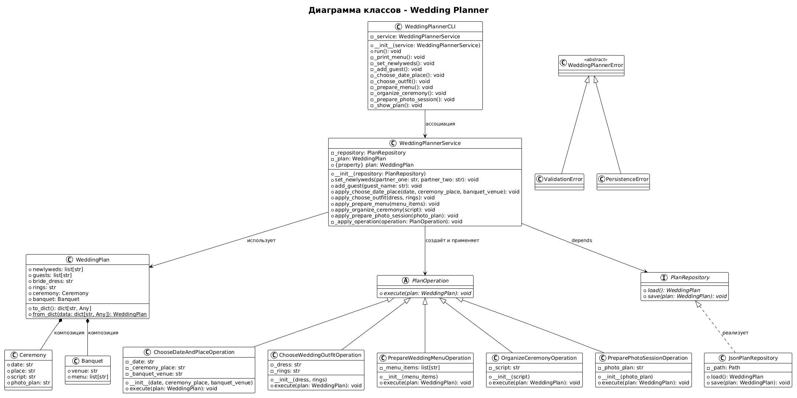
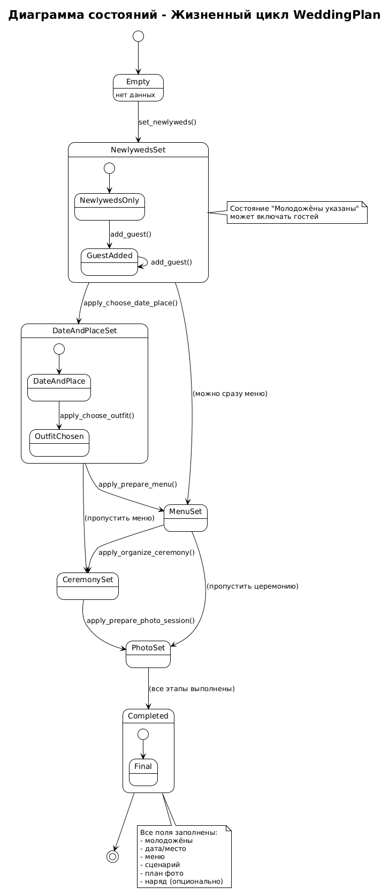

# Планировщик свадьбы (вариант 72)

Система планирования свадебного торжества: **лабораторная №1** (CLI + доменная модель) и **лабораторная №4** (GUI на MVP). Оба режима используют одну модель и один файл состояния.

## Возможности

- Молодожены, гости, платье, кольца, церемония, банкет  
- Операции: дата/места, наряд, меню, сценарий церемонии, фотосессия  
- Сохранение между запусками: `data/wedding_plan.json`  

## Запуск

```bash
python -m venv .venv
source .venv/bin/activate
pip install -U pip pytest

# CLI (л/р №1)
python main.py

# GUI (л/р №4, tkinter)
python main.py --gui
```

Другой файл данных: `python main.py --gui --data path/to/plan.json`

## Архитектура

| Слой | Пакет / модуль |
|------|----------------|
| Модель (л/р №1) | `entities`, `operations`, `planner`, `storage` |
| CLI | `cli` |
| GUI (MVP) | `gui/presenter`, `gui/tk_view` |
| Общее представление | `presentation/` |

Подробная документация л/р №4: [docs/LAB4.md](docs/LAB4.md)

## SOLID

- **S:** отдельные модули для сущностей, операций, хранения, CLI, GUI  
- **O:** новые операции через `PlanOperation`  
- **L:** взаимозаменяемые `PlanRepository`  
- **I:** узкие интерфейсы `PlanOperation`, `PlanRepository`, `IPlanView`  
- **D:** сервис зависит от абстракции репозитория  

## UML





## Тесты

```bash
pytest -q
```

## Требования

- Python 3.11+  
- `pytest`  
- Для GUI: tkinter (пакет `tk` в Arch Linux)  

## GitHub

Исходники и `docs/LAB4.md` предназначены для размещения в репозитории курса PPOIS (`sem_2/lab_4`).
