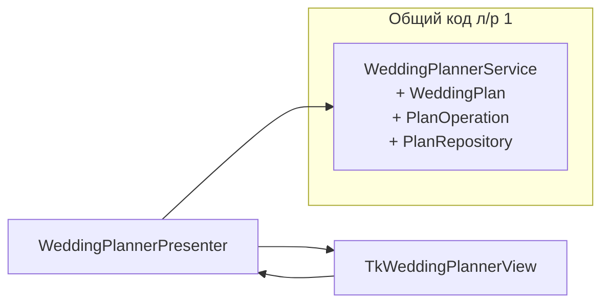

# Лабораторная работа №4 — GUI к планировщику свадьбы

## Цель

Разработать графический пользовательский интерфейс к программной системе из **лабораторной работы №1**, сохранив общую доменную и прикладную логику и возможность запуска приложения в режимах **CLI** и **GUI**.

## Исходная модель (л/р №1)

Предметная область — организация свадебного торжества (вариант 72). Сущности:

| Сущность | Поля в модели |
|----------|----------------|
| Молодожены | `WeddingPlan.newlyweds` |
| Гости | `WeddingPlan.guests` |
| Платье невесты | `WeddingPlan.bride_dress` |
| Кольца | `WeddingPlan.rings` |
| Церемония | `Ceremony` (дата, место, сценарий, фотосессия) |
| Банкет | `Banquet` (место, меню) |

Операции (через `PlanOperation` и `WeddingPlannerService`):

1. Указать молодоженов  
2. Добавить гостя  
3. Выбрать дату и места церемонии/банкета  
4. Выбрать свадебный наряд (платье и кольца)  
5. Подготовить меню банкета  
6. Организовать церемонию (сценарий)  
7. Подготовить план фотосессии  
8. Просмотреть текущий план  

Состояние сохраняется в `data/wedding_plan.json`.

## Архитектура: MVP

Выбран шаблон **Model–View–Presenter** (вариант MVP, близкий к MVC: представление пассивно, логика отображения — в презентере).



| Роль | Компонент | Ответственность |
|------|-----------|-----------------|
| **Model** | `WeddingPlannerService`, `entities`, `operations`, `storage` | Бизнес-логика и персистентность (без UI) |
| **View** | `TkWeddingPlannerView`, `IPlanView` | Отображение состояния, диалоги ввода, уведомления |
| **Presenter** | `WeddingPlannerPresenter` | Команды пользователя → вызовы сервиса → обновление View |

Поток данных при действии пользователя:

1. Пользователь нажимает кнопку во View.  
2. View вызывает метод презентера.  
3. Презентер вызывает `WeddingPlannerService`.  
4. При успехе презентер строит `PlanSnapshot` и передаёт во View.  
5. При ошибке презентер вызывает `show_error`.

CLI (л/р №1) остаётся отдельным **представлением** (`WeddingPlannerCLI`), использующим тот же сервис и общий формат вывода (`presentation/plan_formatter.py`).

## Структура проекта

```
lab_4/
├── main.py                      # argparse: CLI / --gui
├── data/wedding_plan.json
├── docs/LAB4.md                 # данная документация
├── wedding_planner/
│   ├── entities.py              # ┐
│   ├── operations.py            # │ общий код л/р №1 (модель)
│   ├── storage.py               # │
│   ├── planner.py               # ┘
│   ├── bootstrap.py             # фабрика сервиса для обоих UI
│   ├── cli.py                   # представление CLI
│   ├── presentation/            # общее форматирование для CLI и GUI
│   └── gui/                     # л/р №4: MVP + tkinter
│       ├── contracts.py         # IPlanView
│       ├── presenter.py
│       ├── tk_view.py
│       └── app.py
└── tests/
```

## Запуск

### CLI (как в л/р №1)

```bash
cd sem_2/lab_4
python -m venv .venv
source .venv/bin/activate
pip install -U pip pytest
python main.py
```

### GUI (л/р №4)

```bash
python main.py --gui
```

Общий файл данных (можно переопределить):

```bash
python main.py --data data/wedding_plan.json
python main.py --gui --data data/wedding_plan.json
```

На Arch Linux для tkinter при необходимости:

```bash
sudo pacman -S tk
```

## Соответствие SOLID

| Принцип | Реализация в проекте |
|---------|---------------------|
| **S** | `entities` — только данные; `operations` — только операции; `storage` — только I/O; `cli` / `gui` — только UI |
| **O** | Новые операции добавляются классами `PlanOperation` без изменения сервиса |
| **L** | Любая реализация `PlanRepository` взаимозаменяема |
| **I** | Узкие интерфейсы `PlanOperation`, `PlanRepository`, `IPlanView` |
| **D** | `WeddingPlannerService` зависит от `PlanRepository`; презентер — от абстракции View (`IPlanView`) |

## Тестирование

```bash
pytest -q
```

- `tests/test_planner.py`, `tests/unit_tests.py` — домен и сервис (л/р №1).  
- `tests/test_presenter.py` — презентер с mock-View (без графической подсистемы).

## Публикация на GitHub

1. Создать репозиторий на GitHub (или использовать существующий `PPOIS`).  
2. Закоммитить каталог `sem_2/lab_4` (или весь монорепозиторий).  
3. Убедиться, что в репозитории есть `README.md`, `docs/LAB4.md` и исходники `wedding_planner/`.

Пример:

```bash
git add sem_2/lab_4
git commit -m "ЛР4: GUI (MVP) к планировщику свадьбы, общий код с CLI"
git push origin main
```

## Выводы

1. Вынесение доменной логики в `wedding_planner` (без tkinter) позволило добавить GUI без дублирования правил валидации и операций.  
2. Паттерн **MVP** разделил пассивный `TkWeddingPlannerView` и координацию в `WeddingPlannerPresenter`, что упрощает тестирование презентера без GUI.  
3. Общий модуль `presentation` обеспечивает единообразный вывод состояния плана в CLI и в окне приложения.  
4. Единая точка входа `main.py` с флагом `--gui` демонстрирует два способа эксплуатации одной модели — требование лабораторной по совмещению л/р №1 и №4 выполнено.
